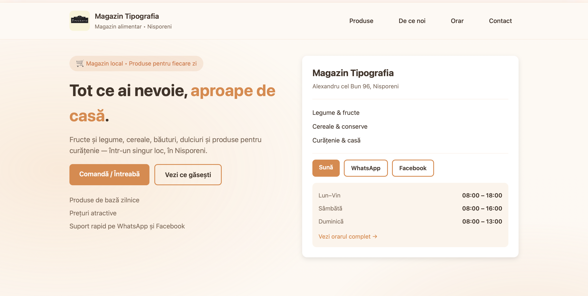
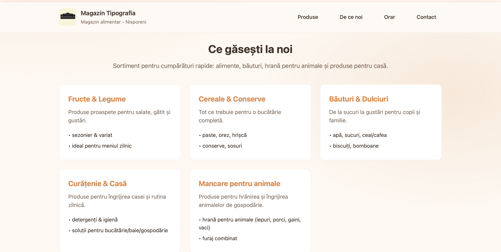
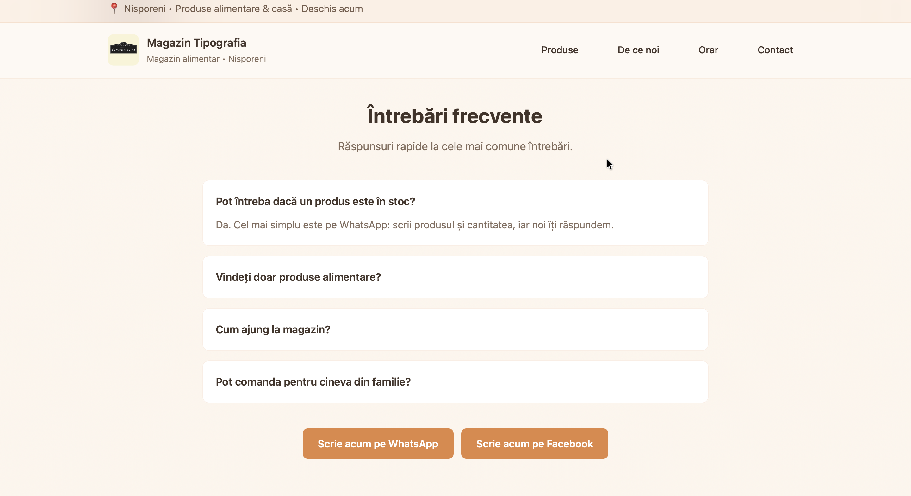
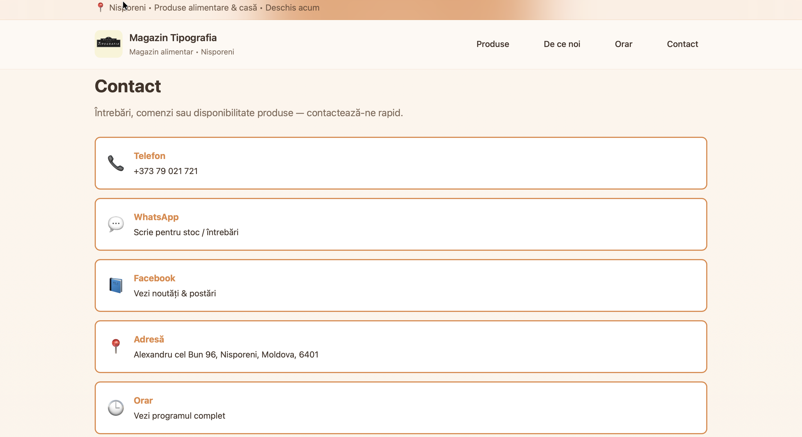
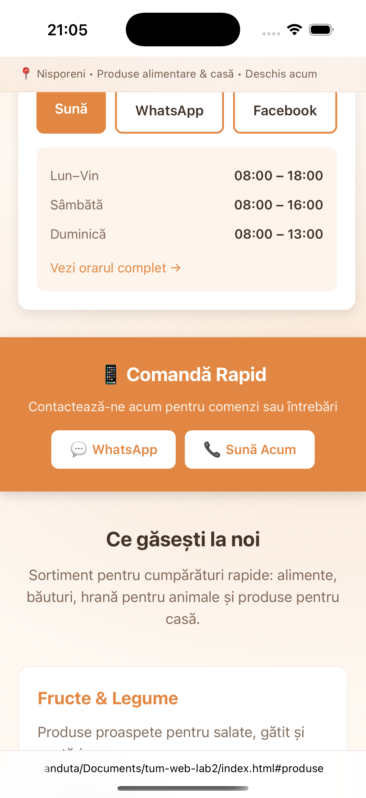
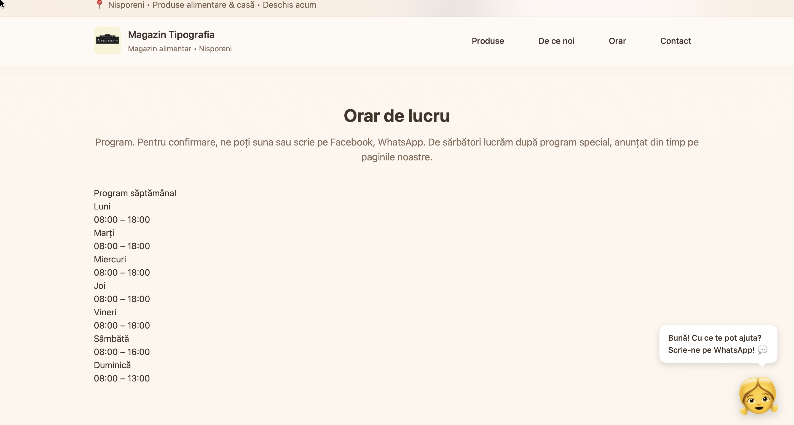
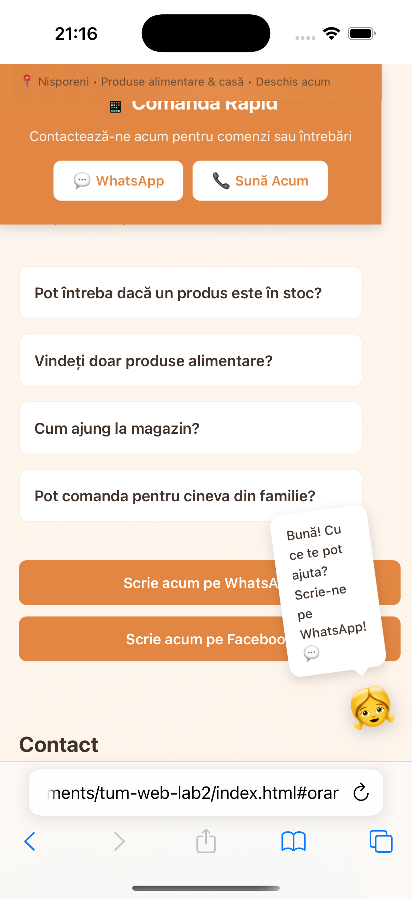

# Magazin Tipografia - Landing Page

A clean and simple landing page for a local grocery store in Nisporeni, Moldova. Built with vanilla HTML and CSS.

## About

This landing page showcases **Magazin Tipografia**, a family-owned grocery store offering:
- Fresh fruits & vegetables
- Cereals, canned goods, and beverages
- Cleaning products and household items
- Animal feed for farm animals

The website provides essential information including product categories, store hours, contact details, and FAQ section.

## Features

- **Fully Responsive Design** - Works perfectly on desktop, tablet, and mobile devices
- **Mobile-Only Quick Contact** - Sticky contact bar visible only on mobile for easy access
- **Animated Mascot** - Friendly girl assistant that appears after 2 seconds with waving animation
- Simple navigation with smooth scrolling
- Product cards showcasing different categories
- Store hours and contact information
- FAQ section with common questions
- Call-to-action buttons for WhatsApp and Facebook

##  Live Demo

[View Live Demo](https://crudualexandra.github.io/tum-web-lab2/)

## 📸 Screenshots

### Hero Section

### Products Section

### FAQ

### Contact Section

##  Technologies

- **HTML5** - Semantic markup
- **CSS3** - Custom styling with modern features
- **Pico CSS** - Minimal CSS framework for enhanced styling
- **Vanilla JavaScript** - Interactive mascot functionality
- **Responsive Grid Layout** - Mobile-first approach

##  Responsive Features

All elements sized appropriately for desktop and mobile  
Call-to-action buttons highly visible on mobile  
Mobile-only quick contact section (sticky bar)  

Animated mascot with tap/click interaction  

##  Mascot Features

The shopping assistant mascot includes:
- 👧  girl character 
- Appears after 2-second delay
- Continuous waving/tilting animation
- Shows helpful message on hover (desktop) or tap (mobile)
- Fully responsive sizing

##  Author

Created by Alexandra Crudu for TUM Web Development Lab 3

---

